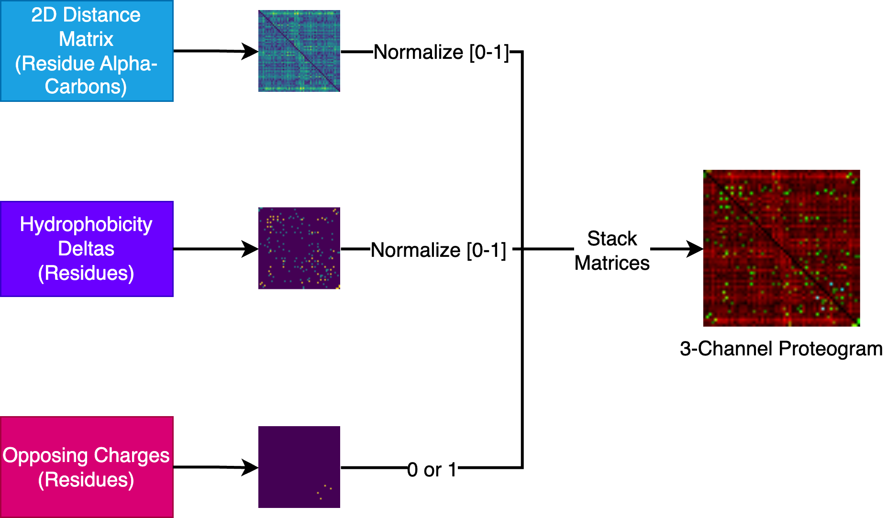

# Proteogram: an image embedding-based search approach to protein structure similarity

This repo has the source code for the `proteogram` project and paper.

## Abstract

**Motivation:**  Huge strides have been made in the last decade in the detection of protein similarity across evolutionarily remote distances using protein structure alignment for known structures (sequence-order dependent/independent, sequence-alignment dependent/independent). These methods accurately identify similar structures according to various measures such as TM-score, RMSD, and cosine-similarity. The main challenges remaining are computational efficiency, gains in accuracy, and new enhancements to the structural data representations, such as the incorporation of physicochemical properties and evolutionary information.  We have developed Proteogram, a new approach to protein structure search that leverages computer vision models to create embedding vectors for a cosine-similarity-based search across a database of Proteograms, wherein each Proteogram represents a single protein monomer as image data.  The Proteogram is a novel data type consisting of three categories of residue-level information:  alpha-carbon backbone distances, hydrophobicity similarities, and charge similarities.  These three dimensions of data are stacked to form an NxN 3-channel data structure (where N is the residue length), which can, consequently, be captured on disk as an RGB image and are inherently sequence-alignment independent. Proteograms not only represent spatial similarity through distograms (the pair-wise residue alpha-carbon distances), but also physicochemical properties of residues through the integration of hydrophobicity values and charge states. Thus, this work outlines a novel and efficient approach to the current challenges in protein structure similarity, alignment, and search.

**Results:** Two state-of-the-art methods in structure alignment and similarity search, USalign and GTalign, serve as points of comparison to the method introduced in our study.  Two evaluation datasets are used to understand search performance, one from the GTalign study and a new one introduced in this paper. On the GTalign evaluation dataset, superfamily and family performance could not be discerned easily, however on a more representative dataset, the Proteogram approach scores highest in Precision@K for superfamily and family-level search results.  Additionally, for the search step itself, the Proteogram approach has the highest throughput (according to pair-wise alignments per minute) of the three methods (1.63 times faster than GTalign and 89.4 times faster than USalign). This unique and promising technique shows the gains that can be achieved by accounting for physicochemical information in addition to spatial information with a data structure compatible with advanced computer vision models.

## Getting started

This repo uses Python 3.8+.

### Installing the package

This project uses [Python Poetry](https://python-poetry.org/) to manage packages.  Using `poetry==1.8.3`, the following commands may be found useful.

To install all packages from the `pyproject.toml`:
```
poetry install
```

### Setting up an environment

A virtual envrionment is highly encouraged.  One way to create a virtaul environment is with the built-in tool `venv` as in:

```
python3 -m venv env
```

To use the virtual environment, it needs to be activated which on Unix systems:
```
source env/bin/activate
```

To activate the virtual envrionment on Windows:
```
env\Scripts\activate
```

See [Create and Use Virtual Environments](https://packaging.python.org/en/latest/guides/installing-using-pip-and-virtual-environments/#create-and-use-virtual-environments) for more on `venv`.

### Set up configuration

Fill out a `config.yml` (based on `config.example.yml`) file and place in the `scripts` folder where all scripts should be run.

### Creating proteograms

To create proteograms of your domains, run the following from the `scripts` folder:
```
python create_proteograms.py
```

### Measure similarity of a single domain to DB of proteograms

To utilize a new structure and compare to a DB (directory) of proteograms, run the following from the `scripts` folder (modify script values for your particular structure - see script):
```
python measure_similarity_single_domain.py
```

Example resulting search image (scores and proteogram files are also output):


### Additional notes

To add a package dependency to the environment (and add to the main dependencies section of the `pyproject.toml`):
```
poetry add <packagename>
```

To add a package dependency to the environment (and add to the dev dependencies section of the `pyproject.toml`):
```
poetry add <packagename> --dev
```

## Workflow for paper where the proteogram approach was compared to GTalign and USalign


### Overview


### Proteogram generation


