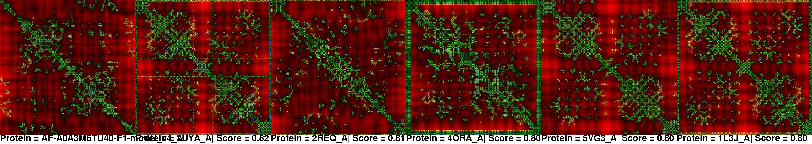

# Proteogram: Compression of Protein Structures into Image Data for Information Retrieval

This repo has the source code for the `proteogram` project and paper.

## Getting started

This repo uses Python 3.8+.

### Installing the package

This project uses [Python Poetry](https://python-poetry.org/) to manage packages.  Using `poetry==1.8.3`, the following commands may be found useful.

To install all packages from the `pyproject.toml`:
```
poetry install
```

### Setting up an environment

A virtual envrionment is highly encouraged.  One way to create a virtaul environment is with the built-in tool `venv` as in:

```
python3 -m venv env
```

To use the virtual environment, it needs to be activated which on Unix systems:
```
source env/bin/activate
```

To activate the virtual envrionment on Windows:
```
env\Scripts\activate
```

See [Create and Use Virtual Environments](https://packaging.python.org/en/latest/guides/installing-using-pip-and-virtual-environments/#create-and-use-virtual-environments) for more on `venv`.

### Set up configuration

Fill out a `config.yml` (based on `config.example.yml`) file and place in the `scripts` folder where all scripts should be run.

### Creating proteograms

To create proteograms of your domains, run the following from the `scripts` folder:
```
python create_proteograms.py
```

### Measure similarity of a single domain to DB of proteograms

To utilize a new structure and compare to a DB (directory) of proteograms, run the following from the `scripts` folder (modify script values for your particular structure - see script):
```
python measure_similarity_single_domain.py
```

Example resulting search image (scores and proteogram files are also output):



### Additional notes

To add a package dependency to the environment (and add to the main dependencies section of the `pyproject.toml`):
```
poetry add <packagename>
```

To add a package dependency to the environment (and add to the dev dependencies section of the `pyproject.toml`):
```
poetry add <packagename> --dev
```

## Workflow for paper where the proteogram approach was compared to GTalign


